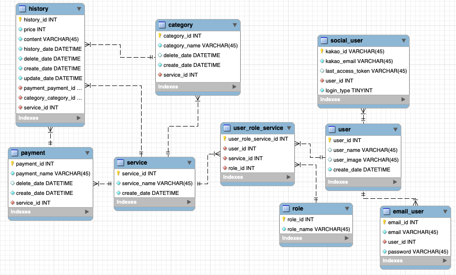

# 우아한 가계부 - 5팀

우아한테크캠프 3번째 프로젝트. - 이종구, 김현영

## 데이터베이스 ERD



## 개발환경

### Client

In `/client`, run

```shell
npm run dev
```

## Test

### Client

In `/client`, run

```shell
npm test
```

## Config

### DB setup

`docker/`의 `.env.sample`을 `.env`로 바꾸고 루트 패스워드, 유저, 패스워드, DB_NAME을 설정합니다.

DB에는 루트가 아닌 위에서 설정한 유저와 패스워드로 접속합니다.

설정을 마치고

```
docker-compose up -d
```

을 실행하면 db가 초기화되어 실행됩니다.

## 실행

`shared/config.env.sample`을 `shared/config.env`로 바꾸고 필요한 정보를 설정합니다.

- PORT: 서버 실행 포트
- DEV_DB, PROD_DB: Database name
- DB_USER, DB_PW, DB_HOST: DB 접속 정보

```shell
./build.sh
```

를 실행하면 필요한 npm package들을 설치하고 서버를 실행하고 클라이언트 코드를 빌드합니다.
