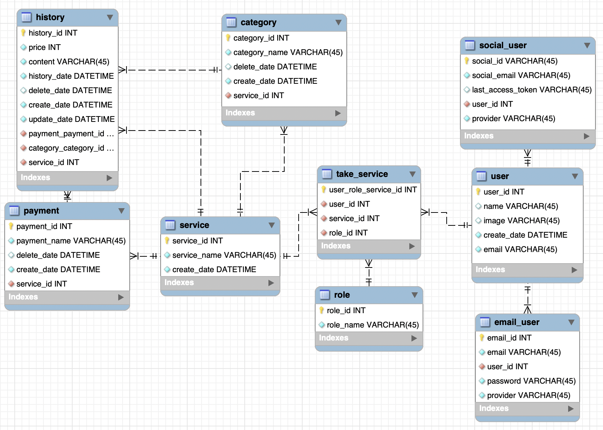

# 한울교회 청년부 Application 


## 데이터베이스 ERD



## 서비스 배포 링크

<div>
<a href="http://jesus4u.co.kr:3000" target="_blank">

</a>
</div>

## Installation

### 환경 구축

```
Ubuntu Server v18.04 LTS (HVM)
node v14.8.0
mysql v8.0.21
yarn v1.22.4
pm2 v4.4.1
```

### 코드 빌드

```
git clone https://github.com/hanwool-chruch/app-hanwool.git
cd app-hanwool
cd client
npm install
npm build
```

### DB setup

`docker/`의 `.env.sample`을 `.env`로 바꾸고 루트 패스워드, 유저, 패스워드, DB_NAME을 설정합니다.

DB에는 루트가 아닌 위에서 설정한 유저와 패스워드로 접속합니다.

설정을 마치고

```
docker-compose up -d
```

을 실행하면 db가 초기화되어 실행됩니다.

### env 설정

**[shared/.env.sample](https://github.com/woowa-techcamp-2020/hkb-5/blob/master/shared/.env.sample) 파일을 참고하여 shared/.env 파일을 생성해주시기 바랍니다.**

- 각 옵션에 대한 가이드입니다.

```
PORT : server를 실행 시킬 포트
DEV_DB : development 환경에서 연결할 데이터베이스 이름
PROD_DB : production 환경에서 연결할 데이터베이스 이름
DB_USER : 두 데이터베이스에 대해 권한을 가지고 있는 mysql user
DB_PW : mysql user의 패스워드
DB_HOST : 데이터베이스 서버 HOST
GOOGLE_CLIENT_ID : Google Console Api에서 발급받은 client id
GOOGLE_CLIENT_SECRET : Google Console Api에서 발급받은 client secret 키
GITHUB_CLIENT_ID: Github Oauth 에서 발급받은 client id
GITHUB_CLIENT_SECRET: Github Oauth 에서 발급받은 client secret 키
```

> [Google Console Api](https://console.developers.google.com/)

### 실행 스크립트

- pm2, development

```
cd server
npm install
npm run pm2:start-dev
```

- pm2, production

```
cd server
npm install
npm run pm2:start
```

- pm2 없이 실행시키기

```
cd server
npm install
npm start
```

### Fork  https://github.com/woowa-techcamp-2020/hkb-5
 - 우아한테크캠프 3번째 프로젝트.